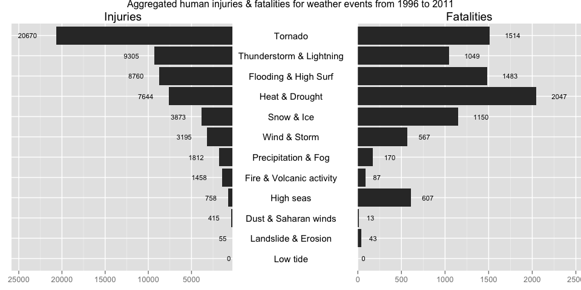
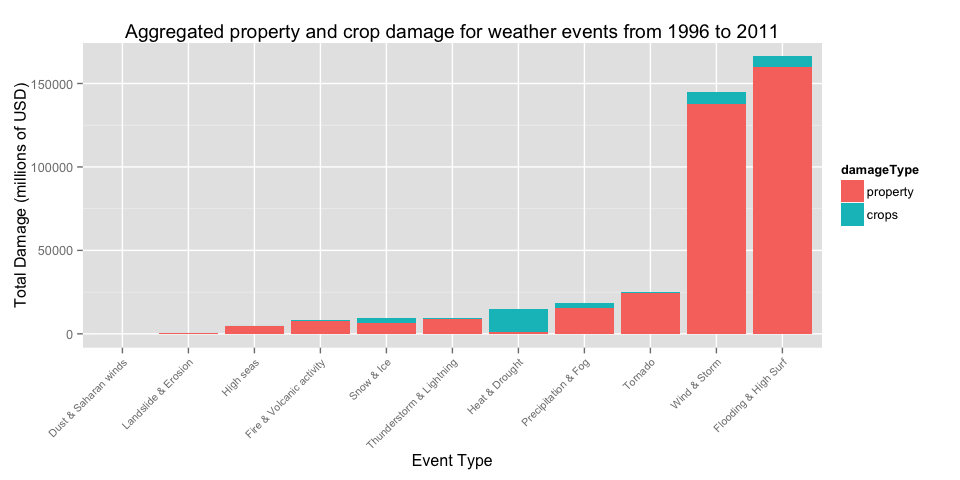

# Analysis of impact, both economic as victims, of different weather events in the USA based on the NOAA Storm Database

By Tom Lous (tomlous@gmail.com)
Date: 19-12-2014

## Reproducible Research: Peer Assessment 2

### 1. Assignment

The basic goal of this assignment is to explore the NOAA Storm Database and answer some basic questions about severe weather events. You must use the database to answer the questions below and show the code for your entire analysis. Your analysis can consist of tables, figures, or other summaries. You may use any R package you want to support your analysis.

### 2. Synopsis

The National Oceanic and Atmospheric Administration (NOAA) maintains a public database for storm event. The data contains the type of storm event, details like location, date, estimates for damage to property as well as the number of human victims of the storm. In this report we investigate which type of events are the most harmful to the population and financially.

The conclusion is that the impact on humans, be it injuries or fatalities, isn't directly correlated to the ecomomic damage weather events cause. Tornado's are by far the highest cause for injuries (#1), and second in fatalities,  whilst heat & drought cause the most fatalities, but fourth in injuries. Both are in the top 5 of injuries & fatalities next to Thunderstorms (resp #2 and #5), Flooding (#3 both) and Snow & Ice (resp. #5 and #4).
In economic damages, only the property damage really factors in the total damage, except for Heat & Drought where more than 90% of damages is determined by crop damage. The #1 & #2 of weather damage sources, resp. Flooding & High Surf and Wind & Storm cover more than 80% of all economic cost, while Wind & Storm aren't even in the top 5 of victims.


### 3. Data Processing


##### 3.1. Load libraries
Necessary libraries to perform loading, computation, transformation and plotting of data

```r
library(RCurl) # for loading external dataset (getBinaryURL)
library(R.utils) # for bunzip2


library(plyr) # for count & aggregate method
library(reshape2) # for melt 

library(ggplot2) # for plots
library(grid) # for grids
library(gridExtra) # for advanced plots
library(scales) # for plot scaling
```


##### 3.2. Load source file and extract it
The results of the data proces are stored in a RData file. To skip ahead to plotting, the RData is loaded when available. Delete it to rerun processing.
Else start loading the specified source files from URL and storing it locally

```r
dataProcess <- TRUE
# check if reducedStormData variable already exists
if(file.exists("./data/StormData.RData")){
  load("./data/StormData.RData")
  dataProcess <- FALSE
}

if(dataProcess){
  # create a data dir if it doesn't exist
  if(!file.exists("./data")){
      dir.create("./data")
  }
  # load file from URL to bz2 file in data dir
  if(!file.exists("./data/StormData.csv.bz2")){
    fileUrl <- "https://d396qusza40orc.cloudfront.net/repdata/data/StormData.csv.bz2"
    destPath <- "./data/StormData.csv.bz2"
    binData <- getBinaryURL(fileUrl, ssl.verifypeer=0L, followlocation=1L)
    destFileHandle <- file(destPath, open="wb")
    writeBin(binData,destFileHandle)
    close(destFileHandle)
  }
  # unzip bz2 file to csv
  if(!file.exists("./data/StormData.csv")){
    filePath <- "./data/StormData.csv.bz2"
    destPath <- "./data/StormData.csv"
    bunzip2(filePath,destPath,overwrite=TRUE, remove=FALSE)
  }
}
```


##### 3.3. Load the data
Read the source .csv file

```r
if(dataProcess){
  csvStormData <- read.csv("./data/StormData.csv")
}
```

##### 3.4. Remove unwanted colums (not used for this analysis)
Just keep the columns: BGN_DATE, EVTYPE, FATALITIES, INJURIES, PROPDMG, PROPDMGEXP, CROPDMG, CROPDMGEXP needed for analysis

```r
if(dataProcess){
  neededColumns <- c("BGN_DATE", "EVTYPE", "FATALITIES", "INJURIES", "PROPDMG", "PROPDMGEXP", "CROPDMG", "CROPDMGEXP")
  reducedStormData <- csvStormData[, neededColumns]
  reducedStormData <- rename(reducedStormData, c("FATALITIES"="fatalities", "INJURIES"="injuries"))
}
```

##### 3.5. Refactor BGN_DATE, determine the offset year to use, and reduce the dataset
Since the later years account for more observations, results could be skewed by the first years.
By still using the majority of the observations, the cutoff point is arbritrarely set at 75% 

```r
if(dataProcess){
  # get some counts
  totalNumberOfObservations <- nrow(reducedStormData)
  cutOffPercentage = 0.75
  cutOffObservations = round(totalNumberOfObservations * cutOffPercentage)
  
  # add columns for date calculations based on BGN_DATEro
  reducedStormData$year = as.numeric(format(as.Date(reducedStormData$BGN_DATE, format = "%m/%d/%Y"), "%Y"))
  
  # create dataset with count per year, reverse the recordset, create running total 
  yearRecords <- count(reducedStormData, "year")
  yearRecords <- yearRecords[order(yearRecords$year, decreasing=TRUE), ]
  yearRecords$runningTotal = cumsum(yearRecords$freq)
  cutOffYear <- min(yearRecords[yearRecords$runningTotal < cutOffObservations, 1])
  
  # reduce the dataset
  reducedStormData <- reducedStormData[reducedStormData$year >= cutOffYear, ]
  endYear <- max(reducedStormData$year)
  
  # clean reducedStormData
  reducedStormData$BGN_DATE <- NULL
  rownames(reducedStormData) <- NULL
}
```

##### 3.6. Refactor EVTYPE into 11 levels
The EVTYPE contains ca. 985 unique source events. Many of them can be reduced to similar instances. 
In this instance there are 11 levels defined, covering effectifly the majority and all useful data records (summaries and combinations are skipped)

```r
if(dataProcess){
  reducedStormData$damageSource <- NA
  
  reducedStormData[grepl("precipitation|rain|hail|drizzle|wet|percip|burst|depression|fog|wall cloud", 
                         reducedStormData$EVTYPE, ignore.case = TRUE), "damageSource"] <- "Precipitation & Fog"
  reducedStormData[grepl("wind|storm|wnd|hurricane|typhoon", 
                         reducedStormData$EVTYPE, ignore.case = TRUE), "damageSource"] <- "Wind & Storm"
  reducedStormData[grepl("slide|erosion|slump", 
                         reducedStormData$EVTYPE, ignore.case = TRUE), "damageSource"] <- "Landslide & Erosion"
  reducedStormData[grepl("warmth|warm|heat|dry|hot|drought|thermia|temperature record|record temperature|record high", 
                         reducedStormData$EVTYPE, ignore.case = TRUE), "damageSource"] <- "Heat & Drought"
  reducedStormData[grepl("cold|cool|ice|icy|frost|freeze|snow|winter|wintry|wintery|blizzard|chill|freezing|avalanche|glaze|sleet", 
                         reducedStormData$EVTYPE, ignore.case = TRUE), "damageSource"] <- "Snow & Ice"
  reducedStormData[grepl("flood|surf|blow-out|swells|fld|dam break", 
                         reducedStormData$EVTYPE, ignore.case = TRUE), "damageSource"] <- "Flooding & High Surf"
  reducedStormData[grepl("seas|high water|tide|tsunami|wave|current|marine|drowning", 
                         reducedStormData$EVTYPE, ignore.case = TRUE), "damageSource"] <- "High seas"
  reducedStormData[grepl("dust|saharan", 
                         reducedStormData$EVTYPE, ignore.case = TRUE), "damageSource"] <- "Dust & Saharan winds"  
  reducedStormData[grepl("tstm|thunderstorm|lightning", 
                         reducedStormData$EVTYPE, ignore.case = TRUE), "damageSource"] <- "Thunderstorm & Lightning"
  reducedStormData[grepl("tornado|spout|funnel|whirlwind", 
                         reducedStormData$EVTYPE, ignore.case = TRUE), "damageSource"] <- "Tornado"
  reducedStormData[grepl("fire|smoke|volcanic", 
                         reducedStormData$EVTYPE, ignore.case = TRUE), "damageSource"] <- "Fire & Volcanic activity"
  
  # remove uncategorized records (damageSource == NA) & cast as factor
  reducedStormData <- reducedStormData[complete.cases(reducedStormData[, "damageSource"]), ]
  reducedStormData$damageSource <- as.factor(reducedStormData$damageSource)
  
  # clean reducedStormData
  reducedStormData$EVTYPE <- NULL
}
```

##### 3.7. Refactor PROPDMG, CROPDMG, PROPDMGEXP & CROPDMGEXP to absolute damage values
Format the DMG and DMGEXP fields in absolute values. Undefined EXP properties, like +, ?, make the record NA

```r
if(dataProcess){
  # function to convert symbol to a power of 10 (for use with PROPDMGEXP & CROPDMGEXP)
  toTenPower <- function(x){
    if(is.numeric(x)) {
      x <- x
    }
    else if(grepl("h", x, ignore.case=TRUE)) {
      x <- 2
    }
    else if(grepl("k", x, ignore.case=TRUE)) {
      x <- 3
    }
    else if(grepl("m", x, ignore.case=TRUE)) {
      x <- 6
    }
    else if(grepl("b", x, ignore.case=TRUE)) {
      x <- 9
    }
    else if(x == "" || x == " "){
      x <- 0
    }
    else{
      x <- NA
    }
    x
  }
   
  # function to take two parameters num and exp and convert it to one absolute value. non integers become 0
  calculateAmount <- function(num, exp){
    pow <- toTenPower(exp)
    if(is.numeric(num)){
      num <- num * (10 ^ pow)
    }
    
    if(!is.numeric(num)){
      num <- 0
    }
    
    num
  }
  
  # create 2 new fields for calculated propDamage & cropDamage and add them to one damageTotal field
  reducedStormData$propDamage <- mapply(calculateAmount, reducedStormData$PROPDMG, reducedStormData$PROPDMGEXP)
  reducedStormData$cropDamage <- mapply(calculateAmount, reducedStormData$CROPDMG, reducedStormData$CROPDMGEXP)
  reducedStormData$damageTotal = reducedStormData$propDamage + reducedStormData$cropDamage
  
  # clean reducedStormData
  reducedStormData$PROPDMG <- NULL
  reducedStormData$PROPDMGEXP <- NULL
  reducedStormData$CROPDMG <- NULL
  reducedStormData$CROPDMGEXP <- NULL
}
```

##### 3.8. Create aggregated datasets and variables for plots
The final data frames must be recast to be used in certain plot funtions

```r
if(dataProcess){
  # aggregate economic damage per damageSource
  sumEconomicDamage <- aggregate(formula=cbind(propDamage, cropDamage, damageTotal) ~ damageSource, data=reducedStormData, FUN=sum, na.rm=TRUE)
  sumEconomicDamage <- sumEconomicDamage[order(sumEconomicDamage$damageTotal, decreasing=TRUE),]
  rownames(sumEconomicDamage) <- NULL
  sumEconomicDamage$damageSource <- factor(sumEconomicDamage$damageSource, levels=rev(sumEconomicDamage$damageSource))
  
  # melt the sumEconomicDamage into data frame to be used as bar chart
  meltSumEconomicDamage <- melt(sumEconomicDamage, id.vars=c("damageSource"), measure.vars=c("propDamage","cropDamage"), variable.name="damageType", value.name="damage")
  levels(meltSumEconomicDamage$damageType)[levels(meltSumEconomicDamage$damageType)=="propDamage"] <- "property"
   levels(meltSumEconomicDamage$damageType)[levels(meltSumEconomicDamage$damageType)=="cropDamage"] <- "crops"
  
  # aggregate humanitarian damage per damageSource
  sumHumanDamage <-aggregate(formula=cbind(injuries, fatalities) ~ damageSource, data=reducedStormData, FUN=sum, na.rm=TRUE) 
  sumHumanDamage <- sumHumanDamage[order(sumHumanDamage$injuries, decreasing=TRUE),]
  rownames(sumHumanDamage) <- NULL
  sumHumanDamage$damageSource <- factor(sumHumanDamage$damageSource, levels=rev(sumHumanDamage$damageSource))
  
  # define max values for bar chart scale
  maxInjuries <- max(sumHumanDamage$injuries)
  maxInjuries <- maxInjuries + round(maxInjuries * 0.25)
 
  maxFatalities <- max(sumHumanDamage$fatalities)
  maxFatalities <- maxFatalities + round(maxFatalities * 0.25)  
}
```

##### 3.10. Save reducedStormData et al to RData file 
Save the processed data to an RData file (see 3.2)

```r
if(dataProcess){
  save(reducedStormData, 
       sumHumanDamage, 
       meltSumEconomicDamage,
       sumEconomicDamage, 
       maxInjuries, 
       maxFatalities,
       cutOffYear,
       endYear,
       file="./data/StormData.RData")
}
```


### 4. Results
##### 4.1. Show the first & last 5 lines of the new data set
Display a few records of the cleaned, reformatted stormData to be used for analysis

```r
head(reducedStormData, n=5L)
```

```
##   fatalities injuries year             damageSource propDamage cropDamage
## 1          0        0 1996               Snow & Ice     380000      38000
## 2          0        0 1996                  Tornado     100000          0
## 3          0        0 1996 Thunderstorm & Lightning       3000          0
## 4          0        0 1996 Thunderstorm & Lightning       5000          0
## 5          0        0 1996 Thunderstorm & Lightning       2000          0
##   damageTotal
## 1      418000
## 2      100000
## 3        3000
## 4        5000
## 5        2000
```

```r
tail(reducedStormData, n=5L)
```

```
##        fatalities injuries year damageSource propDamage cropDamage
## 653526          0        0 2011 Wind & Storm          0          0
## 653527          0        0 2011 Wind & Storm          0          0
## 653528          0        0 2011 Wind & Storm          0          0
## 653529          0        0 2011   Snow & Ice          0          0
## 653530          0        0 2011   Snow & Ice          0          0
##        damageTotal
## 653526           0
## 653527           0
## 653528           0
## 653529           0
## 653530           0
```

##### 4.2. Injuries vs. Fatalities
Juxtaposed the injuries and fatalaties for each major weather event, orderd by number of injuries
You can see that the top 5 for both contain the same events. But Heat & Drought has more casulties than Tornado's, by far the #1 in injuries.
High seas have almost as much casulties as injuries, so it has the worst odds of survival of the list.

```r
# add middle column with just damageSource labels
g.mid <- ggplot(data=sumHumanDamage, aes(x=1,y=damageSource)) +
            geom_text(aes(label=damageSource), size=4) +
            ggtitle("") +
            ylab(NULL) +
            scale_x_continuous(expand=c(0,0),limits=c(0.94,1.065)) +
            theme(axis.title=element_blank(),
                  panel.grid=element_blank(),
                  axis.text.y=element_blank(),
                  axis.ticks.y=element_blank(),
                  panel.background=element_blank(),
                  axis.text.x=element_text(color=NA),
                  axis.ticks.x=element_line(color=NA),
                  plot.margin = unit(c(1,-1,1,-1), "mm"))

# add left chart with injuries
g.injuries <- ggplot(data=sumHumanDamage, aes(x=damageSource, y=injuries)) +
            geom_bar(stat = "identity") + 
            geom_text(aes(label=injuries), size=3, vjust=0.5, hjust=2.0) +
            ggtitle("Injuries") +
            scale_y_reverse(expand=c(0, 0), limits=c(maxInjuries,0)) + 
            coord_flip() +
            theme(axis.title.x = element_blank(), 
                  axis.title.y = element_blank(), 
                  axis.text.y = element_blank(), 
                  axis.ticks.y = element_blank(), 
                  plot.margin = unit(c(1,-1,1,0), "mm")) 

# add right chart with fatalities
g.fatalities <- ggplot(data=sumHumanDamage, aes(x=damageSource, y=fatalities)) +
            geom_bar(stat = "identity") + 
            geom_text(aes(label=fatalities), size=3, vjust=0.5, hjust=-1.0) +
            ggtitle("Fatalities") +
            scale_y_continuous(expand=c(0, 0), limits=c(0,maxFatalities)) + 
            coord_flip() +
            theme(axis.title.x = element_blank(), 
                  axis.title.y = element_blank(), 
                  axis.text.y = element_blank(), 
                  axis.ticks.y = element_blank(), 
                  plot.margin = unit(c(1,0,1,-1), "mm")) 

# combine charts in one plot
gg.injuries <- ggplot_gtable(ggplot_build(g.injuries))
gg.fatalities <- ggplot_gtable(ggplot_build(g.fatalities))
gg.mid <- ggplot_gtable(ggplot_build(g.mid))

grid.arrange(gg.injuries,gg.mid,gg.fatalities,
             ncol=3,widths=c(4/10,2/10,4/10),
             main=paste("Aggregated human injuries & fatalities for weather events from ",cutOffYear," to ",endYear, sep=""))
```

 

The underlying data

```r
sumHumanDamage
```

```
##                damageSource injuries fatalities
## 1                   Tornado    20670       1514
## 2  Thunderstorm & Lightning     9305       1049
## 3      Flooding & High Surf     8760       1483
## 4            Heat & Drought     7644       2047
## 5                Snow & Ice     3873       1150
## 6              Wind & Storm     3190        556
## 7       Precipitation & Fog     1812        170
## 8  Fire & Volcanic activity     1458         87
## 9                 High seas      763        618
## 10     Dust & Saharan winds      415         13
## 11      Landslide & Erosion       55         43
```

##### 4.3. Economic Damage
Crop damage is hardly a factor in comparission to the total economic cost of certain weather events, except for Heat & Drought, where it effects more than 90%
The real interesting ones are Wind & Storm and Flooding & High Surf covering together more than 80% of all economic damage over all the years.
Tornado's,Thunderstorms and Snow & Ice, which have high impact in human costs, hardly matter in economic damages

```r
ggplot(meltSumEconomicDamage, aes(x=damageSource, y=damage/1000000)) + 
  geom_bar(stat = "identity", aes(fill=damageType)) +
  xlab("Event Type") +
  theme(axis.text.x = element_text(angle = 45, size=8, hjust = 1, vjust = 1)) +
  ylab("Total Damage (millions of USD)") +
  ggtitle(paste("Aggregated property and crop damage for weather events from ",cutOffYear," to ",endYear, sep=""))
```

 

The underlying data

```r
sumEconomicDamage
```

```
##                damageSource propDamage cropDamage damageTotal
## 1      Flooding & High Surf  1.599e+11  6.350e+09   1.662e+11
## 2              Wind & Storm  1.380e+11  6.727e+09   1.447e+11
## 3                   Tornado  2.462e+10  2.834e+08   2.491e+10
## 4       Precipitation & Fog  1.520e+10  3.225e+09   1.843e+10
## 5            Heat & Drought  1.057e+09  1.386e+10   1.492e+10
## 6  Thunderstorm & Lightning  8.663e+09  1.024e+09   9.686e+09
## 7                Snow & Ice  6.468e+09  2.816e+09   9.284e+09
## 8  Fire & Volcanic activity  7.761e+09  4.023e+08   8.163e+09
## 9                 High seas  4.798e+09  4.102e+07   4.839e+09
## 10      Landslide & Erosion  3.275e+08  2.002e+07   3.475e+08
## 11     Dust & Saharan winds  6.158e+06  3.100e+06   9.258e+06
```
